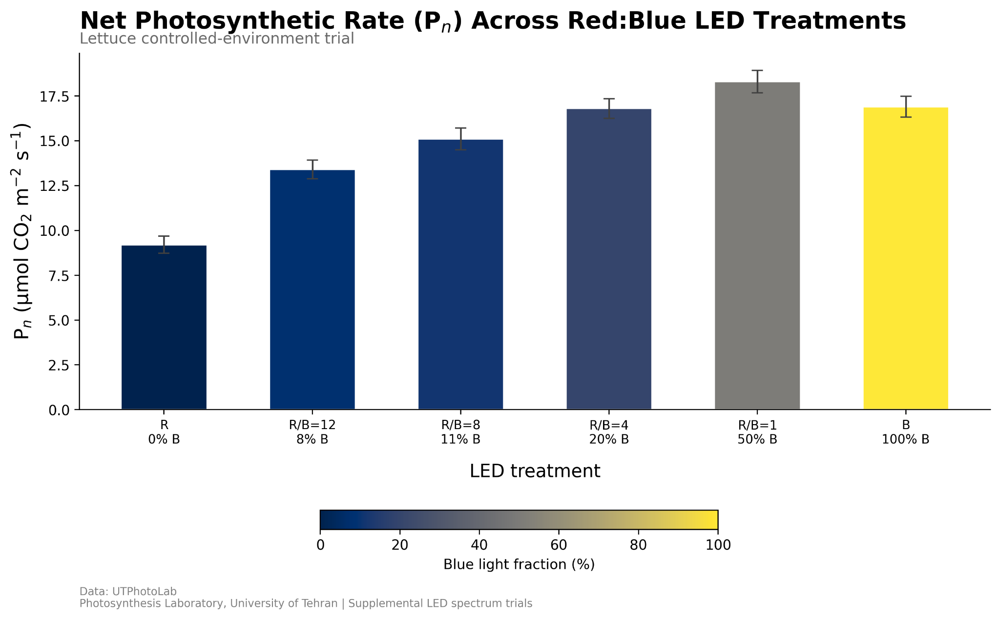
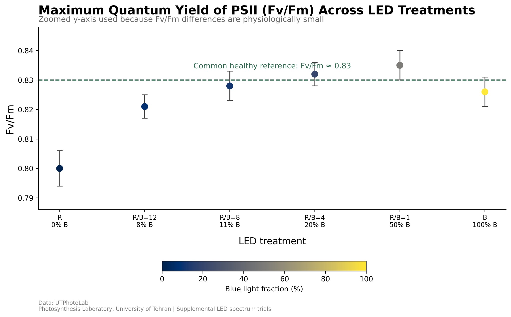
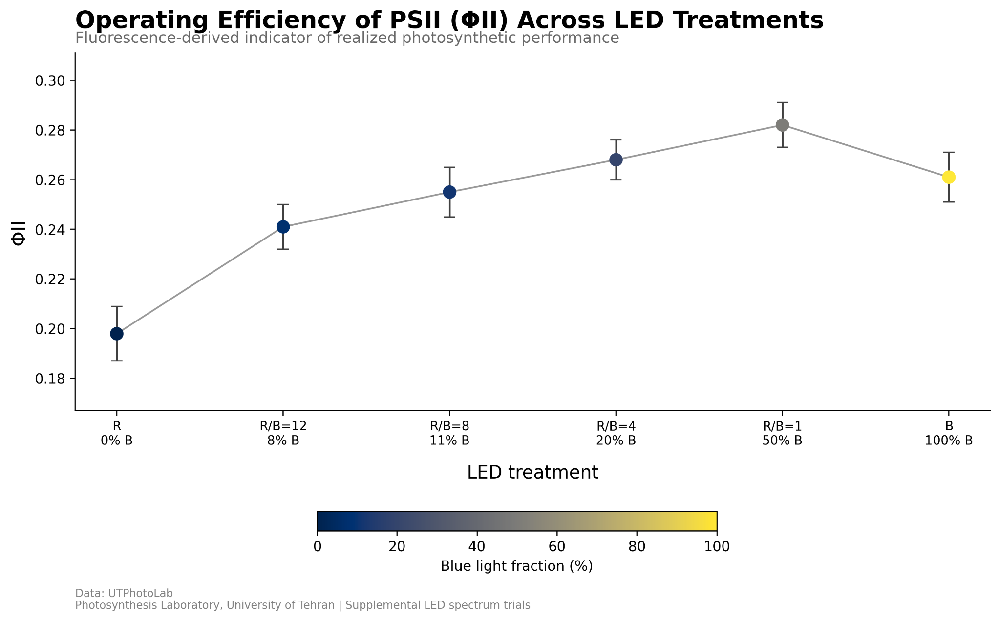
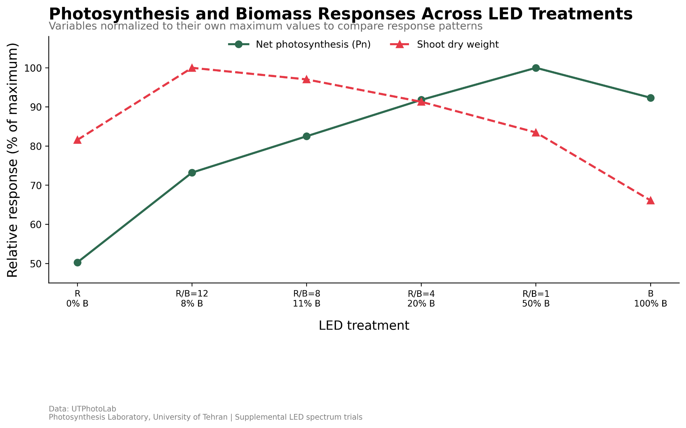

# LED Spectrum Effects on Lettuce Photosynthesis and Chlorophyll Fluorescence

This repository contains a small reproducible R-based plant physiology project on how red:blue LED spectra affect lettuce photosynthesis, chlorophyll fluorescence traits, and biomass response under controlled-environment conditions.

The aim is to demonstrate a complete, transparent analysis workflow: organized data, documented variables, reproducible R code, publication-style figures, and a concise biological interpretation.

## Project question

How do different red:blue LED ratios influence photosynthetic performance, fluorescence-based indicators, and biomass response in lettuce?

## Dataset

The dataset is provided in:

```text
data/utphotolab_lettuce_LED.csv
```

Main variables:

- `Pn`: net photosynthetic rate
- `Fv_Fm`: maximum quantum yield of photosystem II
- `PhiII`: operating efficiency of photosystem II
- `dry_weight_g`: shoot dry weight
- `blue_pct`: blue-light fraction in the LED spectrum

A full variable description is provided in `docs/DATA_DICTIONARY.md`.

## Figures

### 1. Net photosynthetic rate



### 2. Maximum quantum yield of PSII



### 3. Operating efficiency of PSII



### 4. Photosynthesis and biomass response



## Results and interpretation

Across the six red-blue LED treatments, net photosynthetic rate (Pn) 
showed a clear and consistent response to spectral composition. Under 
pure red light (0% blue), Pn was at its lowest, which is consistent 
with the known role of blue light in stimulating stomatal opening and 
enhancing photosynthetic enzyme activity. As the proportion of blue 
light increased from 0% to 50% (R/B=1), Pn rose steadily, reaching 
its peak under the R/B=1 treatment. Interestingly, the pure blue 
treatment (100% blue) did not sustain this peak — Pn dropped slightly 
compared to R/B=1, suggesting that an excess of blue light without 
a red component may limit the overall photochemical efficiency of 
the canopy. This pattern is consistent with findings reported by 
Wang et al. (2016), who observed similar Pn responses in lettuce 
under comparable red:blue LED conditions.

The chlorophyll fluorescence data reinforced this picture. Maximum 
quantum yield of PSII (Fv/Fm) was lowest under pure red light 
(Fv/Fm ≈ 0.80), falling below the commonly cited healthy reference 
value of 0.83. This indicates a degree of photoinhibition or 
suboptimal PSII performance when plants are grown under red light 
alone — a finding that has practical implications for vertical farming 
systems that rely exclusively on red LEDs to reduce energy costs. 
Fv/Fm recovered and stabilised above 0.83 under mixed red:blue 
treatments, peaking at R/B=1, before declining slightly again under 
pure blue light. The operating efficiency of PSII (ΦII) followed 
a broadly similar trend, rising from 0.198 under red-only conditions 
to 0.282 at R/B=1, then decreasing to 0.261 under pure blue light. 
Together, Fv/Fm and ΦII confirm that intermediate red:blue ratios 
support the most efficient photosynthetic machinery in lettuce leaves.

Perhaps the most agronomically important finding is the dissociation 
between photosynthetic rate and shoot biomass accumulation. While Pn 
peaked under R/B=1 (50% blue), shoot dry weight was highest under 
R/B=12 (approximately 8% blue) and declined progressively as blue 
light fraction increased. By the time plants were grown under pure 
blue light, dry weight had fallen to its lowest value despite 
relatively high photosynthetic activity. This divergence suggests 
that blue light, while stimulating photosynthetic efficiency, 
simultaneously promotes compact, slower-growing plant morphology — 
likely through its role in activating photomorphogenic pathways 
involving cryptochromes and phototropins, which suppress cell 
elongation and leaf expansion. In practical terms, this means that 
optimising LED spectra purely on the basis of photosynthetic rate 
measurements would overestimate biomass yield under high-blue 
conditions, and underestimate the growth potential of red-dominant 
spectra.

These results highlight why a multi-variable approach to evaluating 
controlled-environment lighting is essential. No single measurement — 
whether Pn, Fv/Fm, or dry weight — tells the full story on its own. 
For crop production systems where yield is the primary goal, 
red-dominant spectra with a modest blue component (around 8–20%) 
appear to offer the best balance between photosynthetic performance 
and biomass accumulation. For applications where compact morphology 
or secondary metabolite production is the priority, higher blue 
fractions may be more appropriate.

### Reference

Wang, J., Lu, W., Tong, Y., & Yang, Q. (2016). Leaf morphology, 
photosynthetic performance, chlorophyll fluorescence, stomatal 
development of lettuce (Lactuca sativa L.) exposed to different 
ratios of red light to blue light. Frontiers in Plant Science, 7, 250. 
https://doi.org/10.3389/fpls.2016.00250

## How to regenerate the figures

Open RStudio, set this repository folder as the working directory, and run:

```r
source("scripts/01_generate_figures.R")
```

The figures will be saved in the `figures/` folder.

## Repository structure

```text
.
├── README.md
├── data/
│   └── utphotolab_lettuce_LED.csv
├── figures/
│   ├── 01_LED_Pn_by_treatment_clean.png
│   ├── 02_LED_FvFm_by_treatment_clean.png
│   ├── 03_LED_PhiII_by_treatment_clean.png
│   ├── 04_Pn_vs_DryWeight_normalized_clean.png
│   └── summary_table_for_figures.csv
├── scripts/
│   └── 01_generate_figures.R
└── docs/
    ├── DATA_DICTIONARY.md
    └── GITHUB_UPLOAD_STEPS.md
```

## Data provenance

The measurements in this dataset were collected during a vertical 
farming internship I completed in 2022 as part of my Bachelor's 
degree. We were growing lettuce under different LED lighting 
setups in a controlled environment, and I recorded photosynthetic 
and fluorescence readings across the red:blue treatment levels. 
I later used these observations to build this analysis in R, 
mainly to practice working with plant physiology data in a 
reproducible and documented way.

## Note

This is a portfolio project. The analysis was done independently 
after the internship, and the goal was to apply quantitative 
skills to work with real controlled-environment data rather than leave the 
measurements sitting in a notebook.
